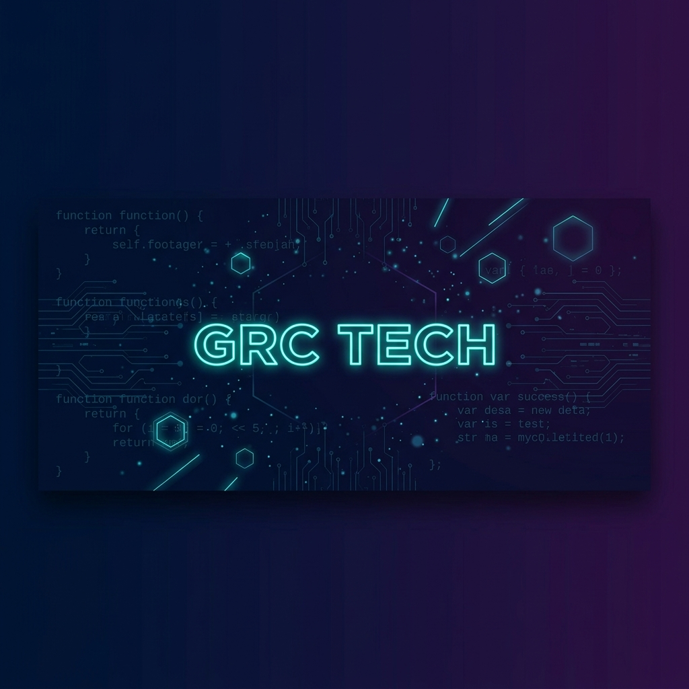
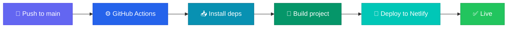

<div align="center">



<br />

# ⚡ Gabriel Rodrigues Calixto — Portfolio

### _An immersive, cinematic developer portfolio built with cutting-edge web technologies._

<br />

[](https://portifolio-grc-tech.netlify.app)
[](https://nextjs.org/)
[](https://www.typescriptlang.org/)
[](https://react.dev/)
[](https://threejs.org/)
[](/)

<br />

[🌐 **Live Demo**](https://portifolio-grc-tech.netlify.app) · [📫 **Contact**](https://portifolio-grc-tech.netlify.app/#contact) · [💼 **LinkedIn**](https://linkedin.com)

<br />


</div>

## 🎬 About

A high-performance, cinematic portfolio showcasing my work as a **Backend / Full-Stack Developer**. The site features immersive 3D elements, smooth scroll-driven animations, dark/light theme switching, and a terminal-inspired interactive section — all optimized for a premium user experience.

> _"Built to be more than a resume — an experience."_

<br />

## 🛠️ Tech Stack

<div align="center">

| Layer | Technologies |
|:---:|:---:|
| **Framework** |  |
| **Language** |  |
| **UI Library** |  |
| **3D Engine** |   |
| **Animations** |   |
| **Smooth Scroll** |  |
| **Styling** |  |
| **Icons** |  |
| **Theming** |  |
| **Deploy** |   |

</div>

<br />

## ✨ Features

<table>
<tr>
<td width="50%">

🎥 **Cinematic Loading Screen**
> Immersive entry animation with a full-screen loader

🌐 **3D Interactive Elements**
> Powered by React Three Fiber & Drei

🧭 **Smooth Scroll Navigation**
> Butter-smooth scrolling with Lenis

🎨 **Dark / Light Theme**
> Seamless theme switching with next-themes

🖱️ **Custom Cursor**
> Responsive cursor that reacts to interactive elements

</td>
<td width="50%">

📽️ **Section Transitions**
> Scale, wipe, and fade transitions between sections

🏗️ **Architecture Showcase**
> Dedicated section for system design philosophy

💻 **Interactive Terminal**
> Command-line inspired section

📱 **Fully Responsive**
> Optimized for all screen sizes

⚡ **Marquee Animations**
> Dynamic scrolling tech banners

</td>
</tr>
</table>

<br />

## 📁 Project Structure

```
src/
├── app/
│   ├── layout.tsx          # Root layout with metadata & SEO
│   ├── page.tsx            # Main page orchestrator
│   └── globals.css         # Global styles & design tokens
├── components/
│   ├── about/              # About section
│   ├── animations/         # Marquee & SectionTransition
│   ├── architecture/       # Architecture showcase
│   ├── contact/            # Contact form section
│   ├── experience/         # Work experience timeline
│   ├── hero/               # Hero section with 3D
│   ├── layout/             # Navbar & Footer
│   ├── projects/           # Projects gallery
│   ├── skills/             # Skills grid
│   ├── ui/                 # CustomCursor, Terminal, LoadingScreen
│   └── Providers.tsx       # Theme & context providers
├── data/
│   ├── experience.ts       # Work experience data
│   ├── projects.ts         # Projects data
│   └── skills.ts           # Skills & categories
├── hooks/
│   ├── useMediaQuery.ts    # Responsive breakpoint hook
│   ├── useMousePosition.ts # Mouse tracking for cursor
│   └── useSmoothScroll.ts  # Lenis smooth scroll hook
└── types/                  # TypeScript type definitions
```

<br />

## 🚀 Getting Started

### Prerequisites

- **Node.js** ≥ 22
- **npm** ≥ 10

### Installation

```bash
# Clone the repository
git clone https://github.com/Rodrigues011xbx/Portifolio-grc-tech-ofc.git

# Navigate to the project
cd Portifolio-grc-tech-ofc

# Install dependencies
npm install

# Start the development server
npm run dev
```

Open [http://localhost:3000](http://localhost:3000) to see the portfolio.

### Available Scripts

| Command | Description |
|---|---|
| `npm run dev` | 🔧 Start development server |
| `npm run build` | 📦 Create production build |
| `npm run start` | 🚀 Start production server |
| `npm run lint` | 🔍 Run ESLint |

<br />

## 🔄 CI/CD Pipeline

The project uses **GitHub Actions** for continuous deployment to Netlify.



### Setup

Two repository secrets are required in **GitHub → Settings → Secrets and variables → Actions**:

| Secret | Source |
|---|---|
| `NETLIFY_AUTH_TOKEN` | Netlify → User Settings → Applications → Personal access tokens |
| `NETLIFY_SITE_ID` | Netlify → Site Configuration → General → Site ID |

The workflow is defined at [`.github/workflows/netlify.yml`](.github/workflows/netlify.yml).

<br />

## 📊 Skills Overview

<div align="center">

| Category | Skills |
|:---:|:---|
| **Languages** |   |
| **Frameworks** |      |
| **Databases** |  |
| **Cloud & Infra** |     |
| **Tools** |    |
| **Architecture** |    |

</div>

<br />

## 📄 License

This project is for personal portfolio purposes.

---

<div align="center">


**Built with ☕ and precision by [Gabriel Rodrigues Calixto](https://portifolio-grc-tech.netlify.app)**

<br />


</div>
