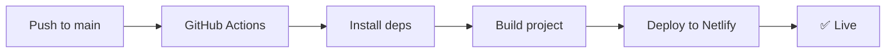

<div align="center">

# ⚡ Gabriel Rodrigues Calixto — Portfolio

**An immersive, cinematic developer portfolio built with cutting-edge web technologies.**

[](https://portifolio-grc-tech.netlify.app)
[](https://nextjs.org/)
[](https://www.typescriptlang.org/)
[](https://react.dev/)
[](https://threejs.org/)

<br />

[🌐 **Live Demo**](https://portifolio-grc-tech.netlify.app) · [📫 **Contact**](https://portifolio-grc-tech.netlify.app/#contact)

</div>

---

## 🎬 About

A high-performance, cinematic portfolio showcasing my work as a **Backend / Full-Stack Developer**. The site features immersive 3D elements, smooth scroll-driven animations, dark/light theme switching, and a terminal-inspired interactive section — all optimized for a premium user experience.

> _"Built to be more than a resume — an experience."_

---

## 🛠️ Tech Stack

| Layer | Technologies |
|---|---|
| **Framework** | Next.js 16 (App Router) |
| **Language** | TypeScript 5 |
| **UI Library** | React 19 |
| **3D Engine** | Three.js · React Three Fiber · Drei |
| **Animations** | Framer Motion · GSAP |
| **Smooth Scroll** | Lenis |
| **Styling** | Tailwind CSS 4 |
| **Icons** | Lucide React |
| **Theming** | next-themes |
| **Deploy** | Netlify (via GitHub Actions CI/CD) |

---

## ✨ Features

- 🎥 **Cinematic Loading Screen** — immersive entry animation
- 🌐 **3D Interactive Elements** — powered by React Three Fiber
- 🧭 **Smooth Scroll Navigation** — butter-smooth scrolling with Lenis
- 🎨 **Dark / Light Theme** — seamless theme switching
- 🖱️ **Custom Cursor** — responsive cursor that reacts to interactive elements
- 📽️ **Section Transitions** — scale, wipe, and fade transitions between sections
- 🏗️ **Architecture Showcase** — dedicated section for system design philosophy
- 💻 **Interactive Terminal** — command-line inspired section
- 📱 **Fully Responsive** — optimized for all screen sizes
- ⚡ **Marquee Animations** — dynamic scrolling tech banners

---

## 📁 Project Structure

```
src/
├── app/
│   ├── layout.tsx          # Root layout with metadata & SEO
│   ├── page.tsx            # Main page orchestrator
│   └── globals.css         # Global styles & design tokens
├── components/
│   ├── about/              # About section
│   ├── animations/         # Marquee & SectionTransition
│   ├── architecture/       # Architecture showcase
│   ├── contact/            # Contact form section
│   ├── experience/         # Work experience timeline
│   ├── hero/               # Hero section with 3D
│   ├── layout/             # Navbar & Footer
│   ├── projects/           # Projects gallery
│   ├── skills/             # Skills grid
│   ├── ui/                 # CustomCursor, Terminal, LoadingScreen
│   └── Providers.tsx       # Theme & context providers
├── data/
│   ├── experience.ts       # Work experience data
│   ├── projects.ts         # Projects data
│   └── skills.ts           # Skills & categories
├── hooks/
│   ├── useMediaQuery.ts    # Responsive breakpoint hook
│   ├── useMousePosition.ts # Mouse tracking for cursor
│   └── useSmoothScroll.ts  # Lenis smooth scroll hook
└── types/                  # TypeScript type definitions
```

---

## 🚀 Getting Started

### Prerequisites

- **Node.js** ≥ 22
- **npm** ≥ 10

### Installation

```bash
# Clone the repository
git clone https://github.com/Rodrigues011xbx/portifolio-corp-grc.git

# Navigate to the project
cd portifolio-corp-grc

# Install dependencies
npm install

# Start the development server
npm run dev
```

Open [http://localhost:3000](http://localhost:3000) to see the portfolio.

### Available Scripts

| Command | Description |
|---|---|
| `npm run dev` | Start development server |
| `npm run build` | Create production build |
| `npm run start` | Start production server |
| `npm run lint` | Run ESLint |

---

## 🔄 CI/CD Pipeline

The project uses **GitHub Actions** for continuous deployment to Netlify.



### Setup

Two repository secrets are required in **GitHub → Settings → Secrets and variables → Actions**:

| Secret | Source |
|---|---|
| `NETLIFY_AUTH_TOKEN` | Netlify → User Settings → Applications → Personal access tokens |
| `NETLIFY_SITE_ID` | Netlify → Site Configuration → General → Site ID |

The workflow is defined at [`.github/workflows/netlify.yml`](.github/workflows/netlify.yml).

---

## 📊 Skills Overview

<div align="center">

**Languages** · TypeScript · JavaScript

**Frameworks** · Node.js · Express · React · Next.js · Three.js

**Databases** · PostgreSQL

**Cloud & Infra** · AWS · Docker · Kubernetes · MinIO

**Tools** · RabbitMQ · Observability · Automated Testing · AI / LLMs

**Architecture** · REST APIs · Software Architecture · Use Cases Architecture · SaaS Systems

</div>

---

## 📄 License

This project is for personal portfolio purposes.

---

<div align="center">

**Built with ☕ and precision by [Gabriel Rodrigues Calixto](https://portifolio-grc-tech.netlify.app)**

</div>
